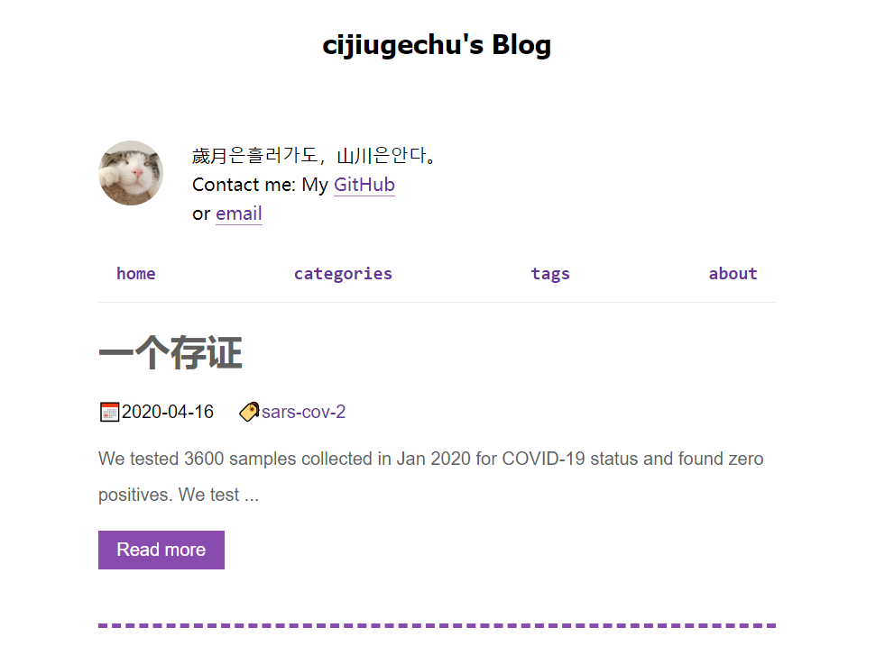

# hexo-theme-fiberless



轻量,简单的Hexo主题。

[English](https://github.com/cijiugechu/hexo-theme-fiberless/blob/master/README.md) | 中文

## 安装

1. 将目录切换到Hexo根目录。

2. 接着键入:
   
```bash
cd themes
```
然后:

```bash
git clone https://github.com/cijiugechu/hexo-theme-fiberless fiberless
```
3. 修改在博客根目录中的 `_config.yml` 文件并将主题切换为 `fiberless`

## 自定义

#### 代码高亮

修改在博客根目录中的 `_config.yml` 文件 ,
将 `highlight -> enable` 改为 `false`

#### 个人简介

添加到 `_config.yml -> about -> Bio` 中即可。